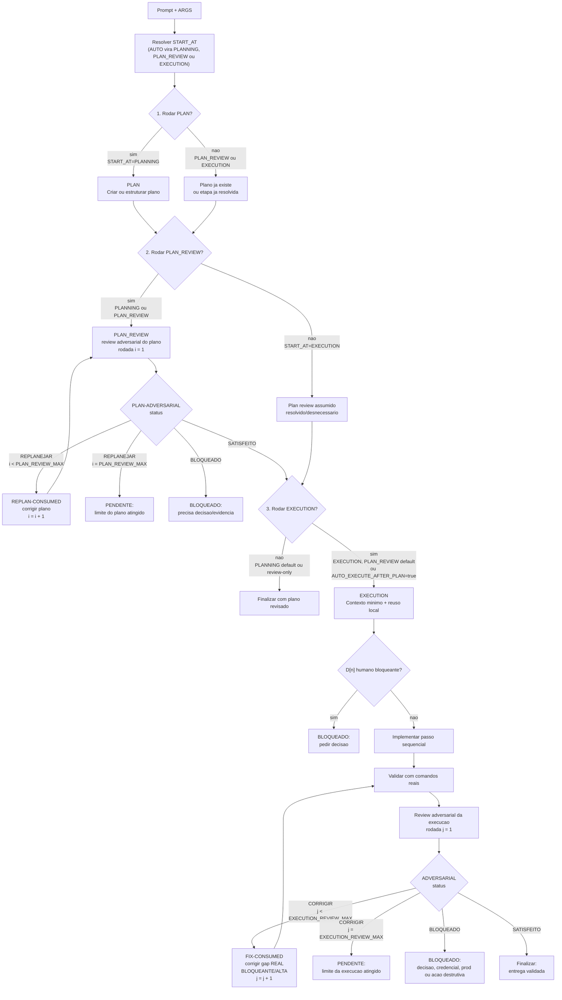

# Agent Swarm

Pacote Codex-native do **LearnHouse Delivery Council**: uma skill
orquestradora, skills de apoio, custom agents e um contrato textual de
parametros para escolher onde o agente entra no fluxo.

O objetivo e simples:

1. Ter uma ordem fixa: `PLAN -> PLAN_REVIEW -> EXECUTION -> EXECUTION_REVIEW`.
2. Permitir que `START_AT` escolha a primeira etapa executada nessa ordem.
3. Comecar direto na execucao, no planejamento ou no review de um plano pronto.
4. Tomar decisoes automaticamente quando os trade-offs forem suficientes.
5. Revisar adversarialmente o plano ate 2 vezes quando houver plano.
6. Revisar adversarialmente a execucao ate 3 vezes, corrigindo gaps criticos.

## Estrutura

```text
agent-swarm/
├─ .github/workflows/ci.yml
├─ .agents/skills/
│  ├─ learnhouse-delivery-council/
│  ├─ adversarial-review/
│  └─ clarification-plan/
├─ .codex/
│  ├─ config.toml
│  └─ agents/
│     ├─ learnhouse-context-scout.toml
│     ├─ learnhouse-implementer.toml
│     ├─ learnhouse-adversarial-reviewer.toml
│     └─ learnhouse-test-auditor.toml
├─ AGENTS.md
├─ README.md
├─ docs/PLANO-SWARM.md
├─ schemas/
├─ scripts/
├─ tests/
└─ verification/
```

## Parametros

Os argumentos sao passados em texto no prompt. Eles nao sao parametros formais
de funcao do runtime Codex.

```text
Use $learnhouse-delivery-council.

ARGS:
START_AT=EXECUTION | PLANNING | PLAN_REVIEW | AUTO
PLAN_SOURCE=<path | inline | issue | diff>
AUTO_DECIDE=true | false
PLAN_REVIEW_MAX=2
EXECUTION_REVIEW_MAX=3
AUTO_EXECUTE_AFTER_PLAN=false | true

TASK:
[pedido]
```

| Parametro | Default | Regra |
|---|---:|---|
| `START_AT` | `AUTO` | Escolhe a primeira etapa executada na ordem fixa. |
| `PLAN_SOURCE` | omitido | Obrigatorio em `PLAN_REVIEW` se o plano nao estiver colado no prompt. |
| `AUTO_DECIDE` | `true` | Escolhe por trade-off quando nao houver decisao humana real. |
| `PLAN_REVIEW_MAX` | `2` | Limite do loop adversarial do plano. Nao aumentar. |
| `EXECUTION_REVIEW_MAX` | `3` | Limite do loop adversarial da execucao. Nao aumentar. |
| `AUTO_EXECUTE_AFTER_PLAN` | depende | `false` em `PLANNING`; `true` em `PLAN_REVIEW`. |

## Modos

| `START_AT` | Primeira etapa executada | Etapas anteriores |
|---|---|---|
| `PLANNING` | `PLAN` | Nenhuma. O agente cria/estrutura o plano. |
| `PLAN_REVIEW` | `PLAN_REVIEW` | `PLAN` ja existe via `PLAN_SOURCE` ou bloco `PLAN`. |
| `EXECUTION` | `EXECUTION` | `PLAN` e `PLAN_REVIEW` sao assumidos como resolvidos ou desnecessarios para esse chamado. |
| `AUTO` | Inferida | O agente normaliza para `PLANNING`, `PLAN_REVIEW` ou `EXECUTION`. |

## Fluxo Principal

Este e o fluxo que importa. A ordem nao muda: `PLAN_REVIEW` vem depois de
`PLAN`, e `EXECUTION` vem depois de `PLAN_REVIEW`. `START_AT` apenas escolhe
onde entrar nessa sequencia.

Regra de gate: execucao so pode sair do caminho de plano se o ultimo
`PLAN_REVIEW` terminar em `SATISFEITO`. `REPLANEJAR` na rodada final e
`PENDENTE` real, nao "pendente formal"; nesse caso a execucao nao comeca.

Em `REPLANEJAR`, a informacao precisa trafegar assim: o reviewer devolve
`REPLAN-REQUEST`; o Council consome esse bloco, altera o plano e registra
`REPLAN-CONSUMED`; so depois roda a proxima rodada de `PLAN_REVIEW`.

Em `CORRIGIR`, a informacao trafega do mesmo jeito: o reviewer devolve
`FIX-REQUEST`; o Council consome esse bloco, corrige a implementacao, registra
`FIX-CONSUMED`, revalida e so depois roda a proxima rodada de `EXECUTION_REVIEW`.



## Exemplos De Uso

### Comecar direto na execucao

```text
Use $learnhouse-delivery-council.

ARGS:
START_AT=EXECUTION
AUTO_DECIDE=true
EXECUTION_REVIEW_MAX=3

TASK:
[descreva a implementacao]
```

### Comecar no planejamento

```text
Use $learnhouse-delivery-council.

ARGS:
START_AT=PLANNING
AUTO_DECIDE=true
PLAN_REVIEW_MAX=2
AUTO_EXECUTE_AFTER_PLAN=false

TASK:
[descreva o problema]
```

### Comecar no review de um plano existente

```text
Use $learnhouse-delivery-council.

ARGS:
START_AT=PLAN_REVIEW
PLAN_SOURCE=docs/design-system/sources/MEU-PLANO.md
AUTO_DECIDE=true
PLAN_REVIEW_MAX=2
EXECUTION_REVIEW_MAX=3
AUTO_EXECUTE_AFTER_PLAN=true

TASK:
Revise o plano existente, execute e revise adversarialmente a execucao.
```

Para plano colado no prompt:

```text
ARGS:
START_AT=PLAN_REVIEW
PLAN_SOURCE=inline

PLAN:
[cole o plano aqui]
```

Para apenas revisar o plano sem executar:

```text
ARGS:
START_AT=PLAN_REVIEW
PLAN_SOURCE=docs/design-system/sources/MEU-PLANO.md
AUTO_EXECUTE_AFTER_PLAN=false
```

## Sentinels Obrigatorios

Review do plano:

```md
PLAN-ADVERSARIAL-VERIFICATION: SATISFEITO | REPLANEJAR | BLOQUEADO
GAPS-CRITICOS: N
DECISAO-ESCOLHIDA: [opcao escolhida ou bloqueio]
PROXIMA-ACAO: [executar | replanejar | pedir decisao]
REPLAN-REQUEST:
- gap: [achado REAL que exige mudanca no plano]
- evidencia: [fonte/codigo/doc/teste que prova o gap]
- alteracao-obrigatoria: [mudanca objetiva que o plano revisado deve incorporar]
```

Consumo obrigatorio do replanejamento:

```md
REPLAN-CONSUMED:
- source-review-round: <n>
- gaps-incorporados: [...]
- plano-alterado-em: [...]
- decisao-atualizada: [...]
```

Review da execucao:

```md
ADVERSARIAL-VERIFICATION: SATISFEITO | CORRIGIR | BLOQUEADO
GAPS-CRITICOS: N
PROXIMA-ACAO: [corrigir | parar | pedir decisao]
FIX-REQUEST:
- gap: [achado REAL BLOQUEANTE/ALTA que exige mudanca na execucao]
- evidencia: [fonte/codigo/doc/teste/log que prova o gap]
- alteracao-obrigatoria: [mudanca objetiva que a correcao deve incorporar]
```

Consumo obrigatorio da correcao:

```md
FIX-CONSUMED:
- source-review-round: <n>
- gaps-corrigidos: [...]
- arquivos-alterados: [...]
- validacao-rodada: [...]
```

Resumo final esperado:

```md
PLAN-ADVERSARIAL-LOOP: <rodadas>/2, status: <SATISFEITO|PENDENTE|BLOQUEADO>
ADVERSARIAL-LOOP: <rodadas>/3, status: <SATISFEITO|PENDENTE|BLOQUEADO>
```

Invalido:

```md
PLAN-ADVERSARIAL-LOOP: 2/2, status: PENDENTE
ADVERSARIAL-LOOP: 1/3, status: SATISFEITO
```

Esse par significa que a execucao rodou depois de plano nao aprovado. Se o gap
do plano foi corrigido apos a segunda rodada, falta uma nova rodada de
`PLAN_REVIEW` antes da execucao.

Tambem e invalido:

```md
ADVERSARIAL-LOOP: 3/3, status: PENDENTE
ADVERSARIAL-VERIFICATION: SATISFEITO
```

Esse par significa que uma correcao foi exigida no limite do loop, mas a
execucao foi declarada satisfeita sem nova validacao adversarial.

## Contrato Executavel

O pacote tem uma camada pequena de verificacao inspirada no witness do Ruflo,
mas sem criar runtime paralelo. A skill continua orquestrando; os scripts so
validam e registram evidencia.

| Camada | Arquivo | Papel |
|---|---|---|
| Validacao unica | `scripts/validate_contract.py` | Roda schemas, skill metadata, witness, testes e `git diff --check`. |
| Skill metadata | `scripts/validate_skills.py` | Valida frontmatter das skills, custom agents TOML e `openai.yaml` sem dependencia externa. |
| Witness | `verification/witness-fixes.json` + `scripts/verify_witness.py` | Garante que marcadores load-bearing do contrato nao sumiram. |
| Schemas | `schemas/*.schema.json` | Forma estruturada opcional para outputs de review e eventos de ledger. |
| Ledger | `scripts/agent_swarm_ledger.py` | Registra rodadas em `.agent-swarm/runs/<run-id>/loop.jsonl` quando houver escrita local. |
| Prompt | `scripts/render_prompt.py` | Gera prompts `ARGS:` validos para reduzir erro humano. |
| Regressao | `tests/test_agent_contract.py` | Testa fluxo, handoffs, payloads, witness, schemas, prompt e ledger. |
| CI | `.github/workflows/ci.yml` | Roda `python3 scripts/validate_contract.py` em push, PR e manual dispatch. |

### Witness

`verification/witness-fixes.json` lista marcadores que nao podem desaparecer,
como `REPLAN-REQUEST`, `REPLAN-CONSUMED`, `FIX-REQUEST`, `FIX-CONSUMED`, gates
finais e o teste `assert_payload_block`. Verifique com:

```bash
python3 scripts/verify_witness.py
```

### Schemas

Os sentinels em Markdown continuam sendo a interface humana. Quando quiser uma
forma de maquina, espelhe o resultado usando:

- `schemas/plan-review-result.schema.json`
- `schemas/execution-review-result.schema.json`
- `schemas/ledger-event.schema.json`

### Ledger

O ledger responde a pergunta: "a mensagem trafegou entre reviewer e Council?"
Use quando o workspace onde o agente roda tiver escrita local:

```bash
python3 scripts/agent_swarm_ledger.py append \
  --run-id entrega-auth-001 \
  --loop execution \
  --round 1 \
  --event fix-request \
  --status CORRIGIR \
  --payload-json '{"gap":"...","evidencia":"...","alteracao_obrigatoria":"..."}'

python3 scripts/agent_swarm_ledger.py summary --run-id entrega-auth-001
```

Os registros ficam em `.agent-swarm/runs/`, que e ignorado pelo git.

### Prompt Generator

```bash
python3 scripts/render_prompt.py \
  --start-at EXECUTION \
  --task "Corrigir fluxo de refresh token"
```

## Arquivos Principais

| Arquivo | Funcao |
|---|---|
| `.agents/skills/learnhouse-delivery-council/SKILL.md` | Skill orquestradora e contrato dos modos. |
| `.agents/skills/adversarial-review/SKILL.md` | Auditoria adversarial com evidencia. |
| `.agents/skills/clarification-plan/SKILL.md` | Decisoes humanas D[n]. |
| `.codex/agents/learnhouse-adversarial-reviewer.toml` | Reviewer read-only com sentinels. |
| `.codex/agents/learnhouse-context-scout.toml` | Scout read-only de contexto. |
| `.codex/agents/learnhouse-implementer.toml` | Implementador workspace-write. |
| `.codex/agents/learnhouse-test-auditor.toml` | Auditor read-only de validacao. |
| `.codex/config.toml` | Limites de project docs e fan-out. |
| `schemas/*.schema.json` | Contratos estruturados opcionais para reviews e ledger. |
| `scripts/*.py` | Validacao, witness, ledger e prompt generator. |
| `verification/witness-fixes.json` | Marcadores load-bearing do contrato. |
| `.github/workflows/ci.yml` | CI self-contained do contrato. |

## Validacao

```bash
python3 scripts/validate_contract.py
```

## Manutencao

- Se mudar parametro, atualize a tabela e o fluxo principal.
- Se mudar limite de loop, atualize os ramos `i < PLAN_REVIEW_MAX` e
  `j < EXECUTION_REVIEW_MAX`.
- Se mudar sentinel, atualize a skill, o reviewer TOML, os schemas, witness e
  testes de regressao.
- Se mudar fluxo/handoff, adicione marcador em `verification/witness-fixes.json`
  e teste negativo em `tests/test_agent_contract.py`.
- Nao publique segredos, `.claude/`, logs, dumps ou detalhes privados de
  cliente neste repositorio.
