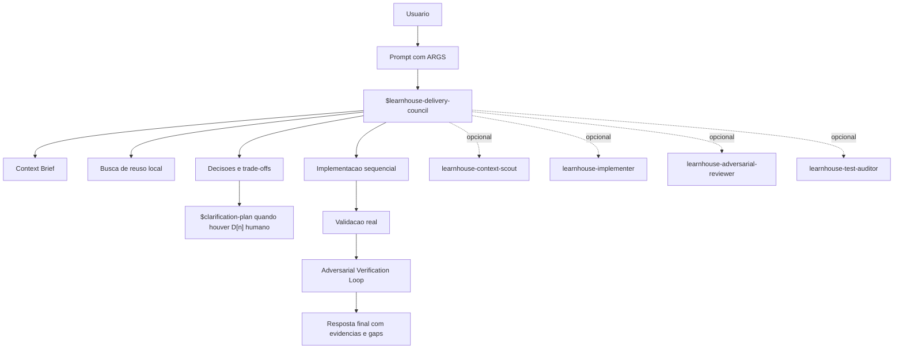
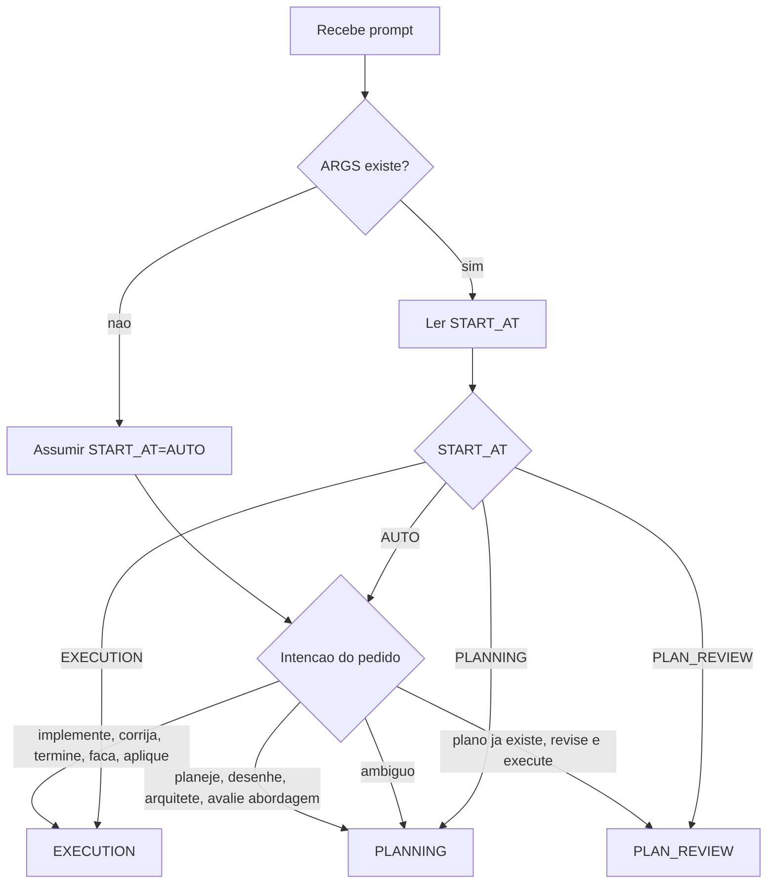
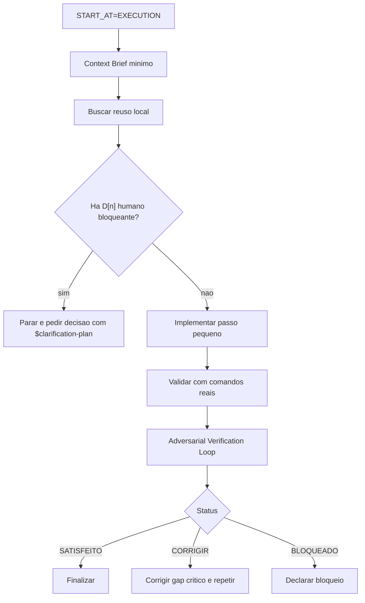
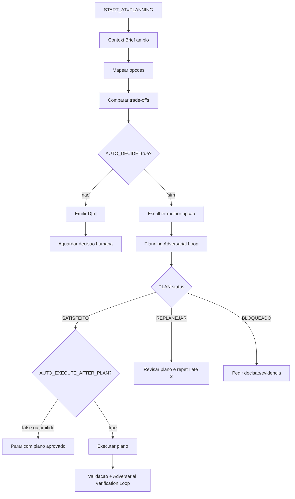
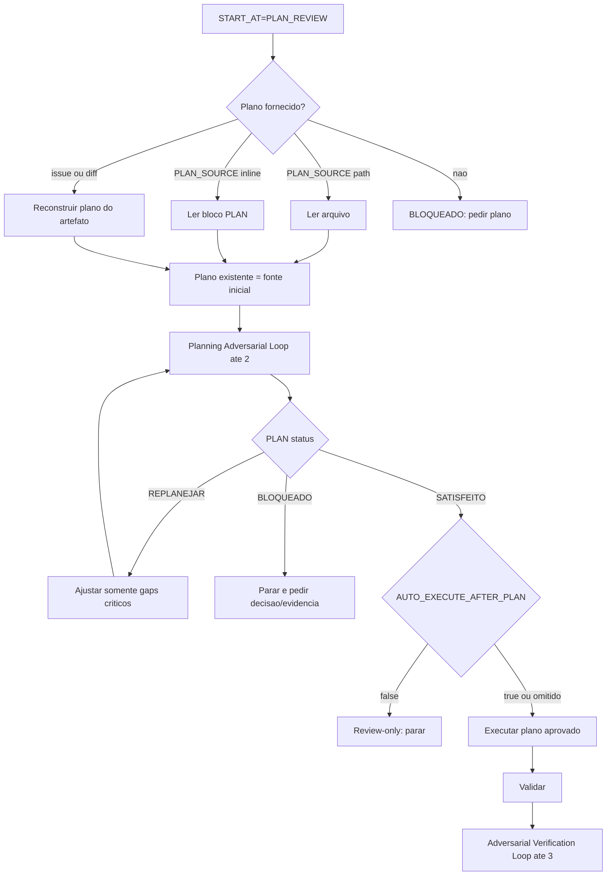
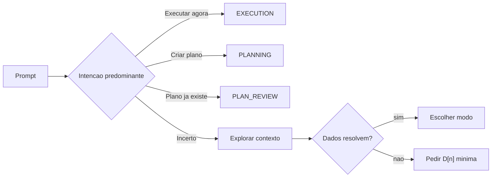
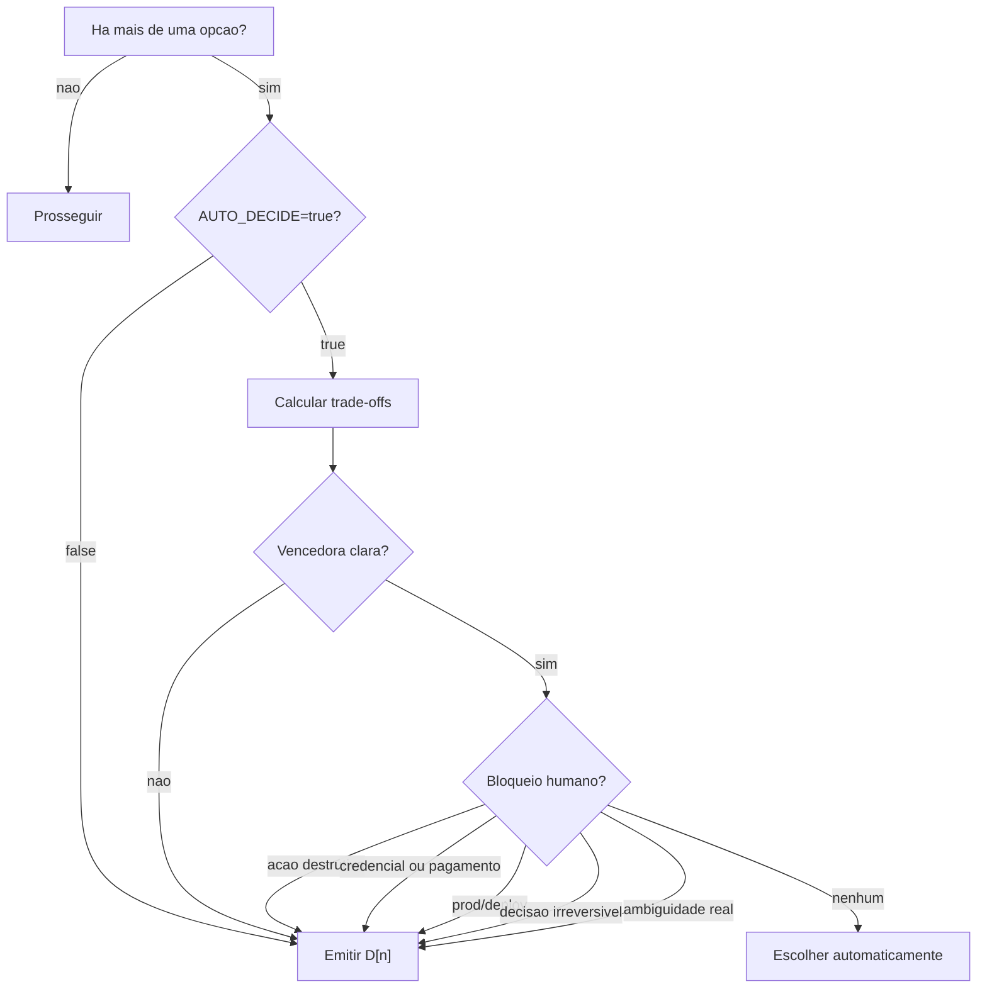
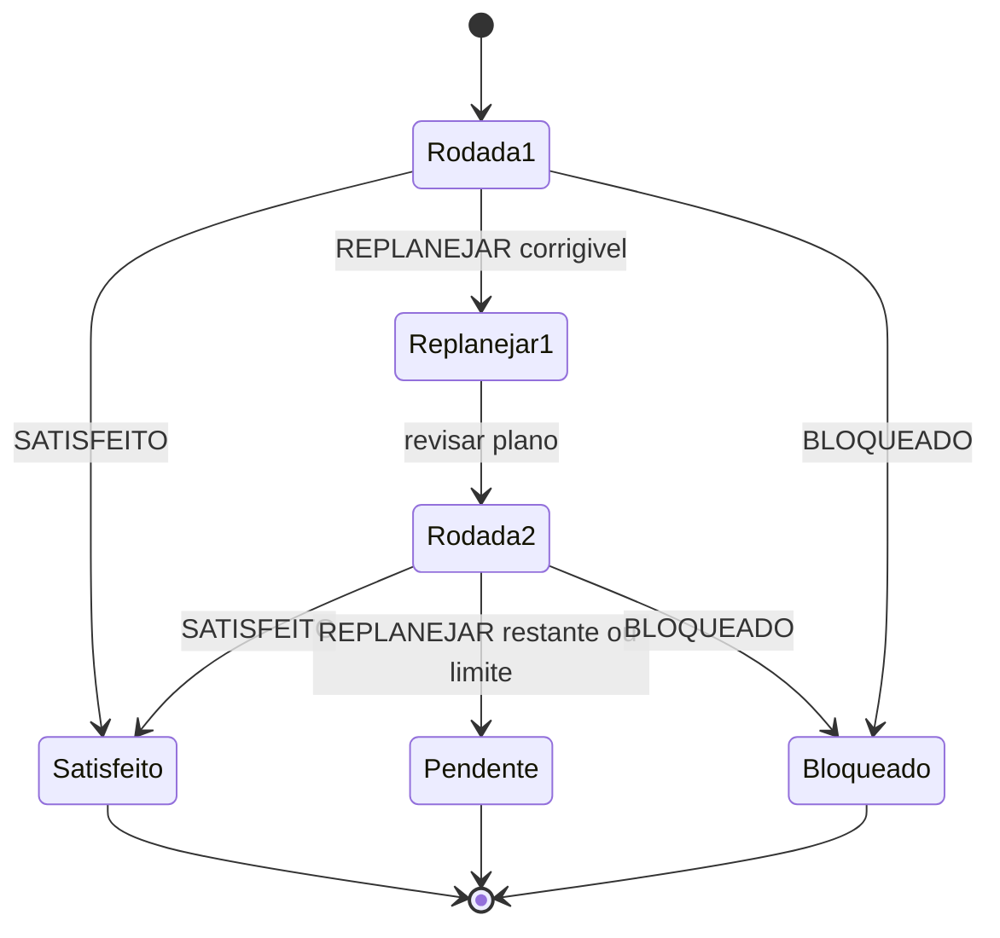
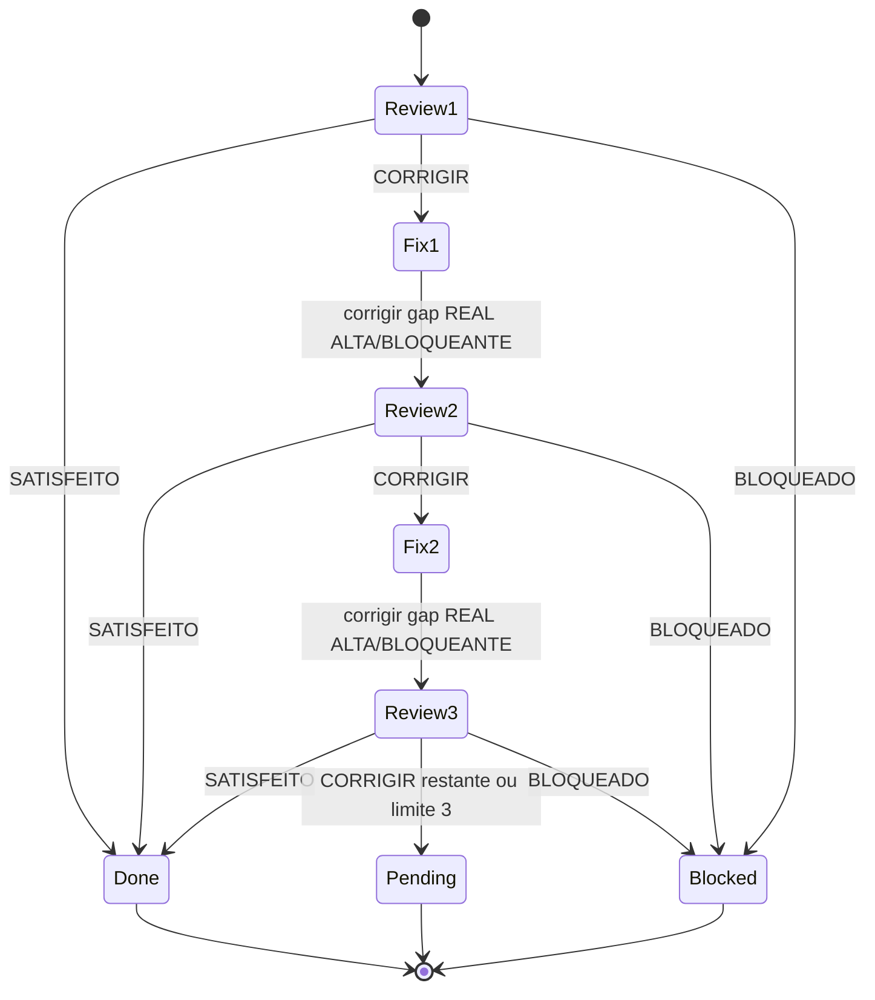
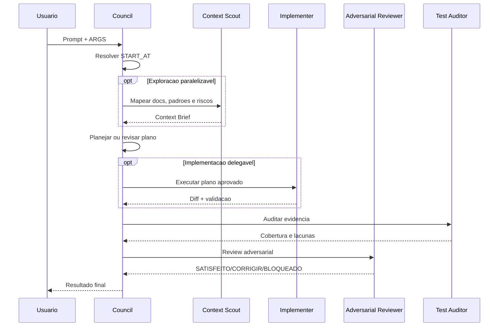

# Agent Swarm

Pacote Codex-native para orquestrar entregas complexas com skills, custom agents,
parametrizacao textual e loops adversariais de verificacao.

Este repositorio publica o agente **LearnHouse Delivery Council**. Ele foi
desenhado para uso dentro da extensao Codex no VS Code, Codex CLI ou Codex App,
sem runner Python proprio, sem Agents SDK como requisito e sem depender de
`OPENAI_API_KEY` para o fluxo principal.

## Estrutura

```text
agent-swarm/
├─ README.md
├─ AGENTS.md
├─ .codex/
│  ├─ config.toml
│  └─ agents/
│     ├─ learnhouse-context-scout.toml
│     ├─ learnhouse-implementer.toml
│     ├─ learnhouse-adversarial-reviewer.toml
│     └─ learnhouse-test-auditor.toml
├─ .agents/
│  └─ skills/
│     ├─ clarification-plan/
│     ├─ adversarial-review/
│     └─ learnhouse-delivery-council/
└─ docs/
   └─ PLANO-SWARM.md
```

## Arquitetura



## Parametros

Os argumentos sao texto no prompt, nao parametros formais de funcao.

```text
Use $learnhouse-delivery-council.

ARGS:
START_AT=EXECUTION | PLANNING | PLAN_REVIEW | AUTO
PLAN_SOURCE=<path | inline | issue | diff>
AUTO_DECIDE=true | false
PLAN_REVIEW_MAX=2
EXECUTION_REVIEW_MAX=3
AUTO_EXECUTE_AFTER_PLAN=false | true

TASK:
[pedido]
```

| Parametro | Valores | Default | Funcao |
|---|---|---:|---|
| `START_AT` | `EXECUTION`, `PLANNING`, `PLAN_REVIEW`, `AUTO` | `AUTO` | Define onde o fluxo comeca. |
| `PLAN_SOURCE` | `path`, `inline`, `issue`, `diff` | omitido | Fonte do plano quando `START_AT=PLAN_REVIEW`. |
| `AUTO_DECIDE` | `true`, `false` | `true` | Permite escolher automaticamente por trade-off. |
| `PLAN_REVIEW_MAX` | inteiro, maximo `2` | `2` | Limite do Planning Adversarial Loop. |
| `EXECUTION_REVIEW_MAX` | inteiro, maximo `3` | `3` | Limite do Adversarial Verification Loop. |
| `AUTO_EXECUTE_AFTER_PLAN` | `true`, `false` | depende | Controla execucao apos plano/review de plano. |

Defaults condicionais:

| Modo | `AUTO_EXECUTE_AFTER_PLAN` efetivo |
|---|---:|
| `START_AT=PLANNING` | `false` |
| `START_AT=PLAN_REVIEW` | `true` |
| `START_AT=EXECUTION` | irrelevante |
| `START_AT=AUTO` | inferido |

## Dispatcher



## Matriz De Modos

| Modo | Comeca por | Edita codigo antes de review de plano? | Saida normal |
|---|---|---:|---|
| `EXECUTION` | Contexto minimo + reuso local | sim, se nao houver D[n] bloqueante | Validacao + execution review. |
| `PLANNING` | Criar/estruturar plano | nao | Plano aprovado, salvo `AUTO_EXECUTE_AFTER_PLAN=true`. |
| `PLAN_REVIEW` | Revisar plano existente | nao | Execucao por default, salvo review-only. |
| `AUTO` | Inferir intencao | depende | Redireciona para um modo acima. |

## Fluxo EXECUTION

```text
Use $learnhouse-delivery-council.

ARGS:
START_AT=EXECUTION
AUTO_DECIDE=true
EXECUTION_REVIEW_MAX=3

TASK:
[descreva a implementacao]
```



## Fluxo PLANNING

Por default, este modo para no plano revisado/aprovado.

```text
Use $learnhouse-delivery-council.

ARGS:
START_AT=PLANNING
AUTO_DECIDE=true
PLAN_REVIEW_MAX=2
AUTO_EXECUTE_AFTER_PLAN=false

TASK:
[descreva o problema ou feature]
```



## Fluxo PLAN_REVIEW

Use quando o plano ja existe. Este modo pula a criacao do plano inicial, revisa
o plano existente, executa por default e revisa a execucao.

```text
Use $learnhouse-delivery-council.

ARGS:
START_AT=PLAN_REVIEW
PLAN_SOURCE=docs/design-system/sources/MEU-PLANO.md
AUTO_DECIDE=true
PLAN_REVIEW_MAX=2
EXECUTION_REVIEW_MAX=3
AUTO_EXECUTE_AFTER_PLAN=true

TASK:
Revise o plano existente, execute o que estiver aprovado e rode review adversarial da execucao.
```

Plano inline:

```text
ARGS:
START_AT=PLAN_REVIEW
PLAN_SOURCE=inline
AUTO_DECIDE=true
PLAN_REVIEW_MAX=2
EXECUTION_REVIEW_MAX=3

PLAN:
[cole o plano aqui]
```

Review-only:

```text
ARGS:
START_AT=PLAN_REVIEW
PLAN_SOURCE=docs/design-system/sources/MEU-PLANO.md
AUTO_EXECUTE_AFTER_PLAN=false
```



## Fluxo AUTO



## AUTO_DECIDE

`AUTO_DECIDE=true` escolhe automaticamente quando existe vencedora clara por:

- delta de qualidade;
- delta de custo;
- breakeven;
- condicao de nao adocao;
- reversibilidade;
- aderencia a docs e padroes locais.



## Planning Adversarial Loop

Aplicavel a `PLANNING` e `PLAN_REVIEW`.

```md
PLAN-ADVERSARIAL-VERIFICATION: SATISFEITO | REPLANEJAR | BLOQUEADO
GAPS-CRITICOS: N
DECISAO-ESCOLHIDA: [opcao escolhida ou bloqueio]
PROXIMA-ACAO: [executar | replanejar | pedir decisao]
```



Saida:

```md
PLAN-ADVERSARIAL-LOOP: <rodadas>/2, status: <SATISFEITO|PENDENTE|BLOQUEADO>
```

## Adversarial Verification Loop

Aplicavel ao final de execucao de risco medio/alto.

```md
ADVERSARIAL-VERIFICATION: SATISFEITO | CORRIGIR | BLOQUEADO
GAPS-CRITICOS: N
PROXIMA-ACAO: [corrigir | parar | pedir decisao]
```



Corrigir automaticamente somente quando o gap for `REAL`,
`BLOQUEANTE`/`ALTA`, corrigivel no workspace atual e sem decisao humana,
credencial, ambiente externo, prod/deploy ou acao destrutiva.

Saida:

```md
ADVERSARIAL-LOOP: <rodadas>/3, status: <SATISFEITO|PENDENTE|BLOQUEADO>
```

## Subagents

Subagents sao opcionais e devem ser usados quando a tarefa for paralelizavel ou
quando o usuario pedir delegacao explicitamente.



## Instalacao Em Outro Repo

Copie os diretorios para a raiz do repo alvo:

```bash
cp -R .agents .codex /path/to/repo/
```

Depois adicione ao `AGENTS.md` do repo alvo apenas o bloco operacional
necessario. Nao copie credenciais, `.claude/`, dumps, logs de producao ou
instrucoes privadas.

## Arquivos Principais

| Arquivo | Funcao |
|---|---|
| `.agents/skills/learnhouse-delivery-council/SKILL.md` | Skill orquestradora e contrato dos modos. |
| `.agents/skills/adversarial-review/SKILL.md` | Auditoria adversarial com evidencia. |
| `.agents/skills/clarification-plan/SKILL.md` | Formato D[n] para decisoes humanas. |
| `.codex/agents/learnhouse-context-scout.toml` | Explorer read-only para contexto. |
| `.codex/agents/learnhouse-implementer.toml` | Executor workspace-write. |
| `.codex/agents/learnhouse-adversarial-reviewer.toml` | Reviewer read-only com sentinels. |
| `.codex/agents/learnhouse-test-auditor.toml` | Auditor read-only de evidencia. |
| `.codex/config.toml` | Limites de project docs e fan-out de agents. |
| `docs/PLANO-SWARM.md` | Plano-fonte historico da decisao Codex-native. |

## Validacao

```bash
python3 /home/augusto/.codex/skills/.system/skill-creator/scripts/quick_validate.py .agents/skills/learnhouse-delivery-council
python3 /home/augusto/.codex/skills/.system/skill-creator/scripts/quick_validate.py .agents/skills/adversarial-review
python3 /home/augusto/.codex/skills/.system/skill-creator/scripts/quick_validate.py .agents/skills/clarification-plan
python3 - <<'PY'
import pathlib
import tomllib
import yaml

for path in pathlib.Path(".codex/agents").glob("*.toml"):
    tomllib.loads(path.read_text())
tomllib.loads(pathlib.Path(".codex/config.toml").read_text())
yaml.safe_load(pathlib.Path(".agents/skills/learnhouse-delivery-council/agents/openai.yaml").read_text())
print("parse-ok")
PY
git diff --check
```

Verificacao semantica minima:

```bash
rg -n "START_AT=EXECUTION \\| PLANNING \\| PLAN_REVIEW \\| AUTO|PLAN_SOURCE|PLAN-ADVERSARIAL-VERIFICATION|ADVERSARIAL-VERIFICATION" .
```

## Checklist De Manutencao

- Mudou `START_AT`: atualize README, skill, reviewer TOML e exemplos.
- Mudou sentinel: atualize reviewer e diagramas.
- Mudou limite de loop: atualize `PLAN_REVIEW_MAX`, `EXECUTION_REVIEW_MAX` e
  state diagrams.
- Adicionou skill de apoio: declare no README e na skill orquestradora.
- Nunca publique segredos, `.claude/`, credenciais ou detalhes privados de
  cliente neste repo publico.

## Licenca

Ainda nao ha licenca definida. Nao assuma permissao de uso externo ate uma
licenca ser adicionada pelo dono do repositorio.
